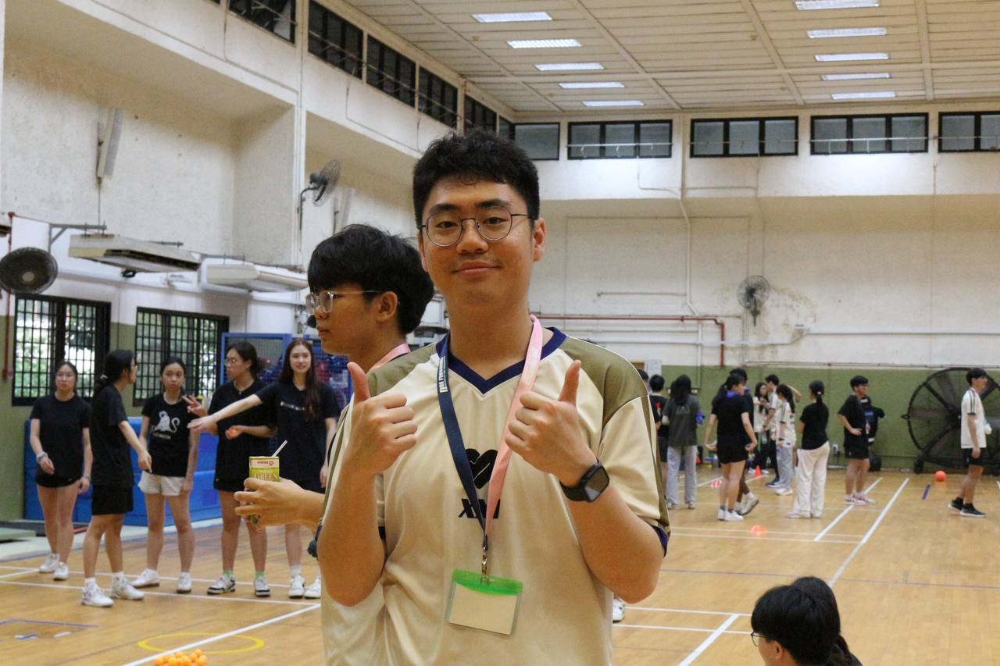
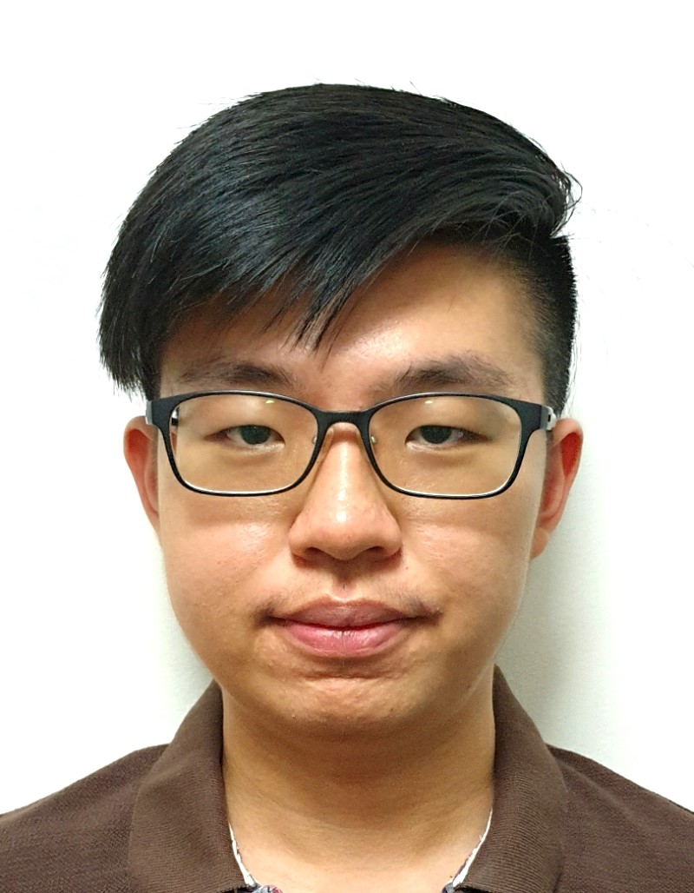

We are a team based in the [School of Computing, National University of Singapore](https://www.comp.nus.edu.sg).

You can reach us at the email `seer[at]comp.nus.edu.sg`

## Project team

### Kok Yong Hsien

[[homepage](http://www.comp.nus.edu.sg/~damithch)]
[[github](https://github.com/YHKok)]
[[portfolio](team/johndoe.md)]

* Role: Deliverables and deadlines

### Jane Doe

[[github](http://github.com/johndoe)]
[[portfolio](team/johndoe.md)]

* Role: Team Lead
* Responsibilities: UI

### Loh Xian Jie

[[github](https://github.com/XJie97)]
[[portfolio](team/lohxianjie.md)]

* Role: Developer
* Responsibilities: Data

### Tan Ming Zhe

[[github](http://github.com/tgonet)]

* Role: Developer
* Responsibilities: AY2526S1-CS2103-F11 team member

### Gareth Too Yu Sheng

[[github](https://github.com/Gareth2YuSheng)]
[[portfolio](team/johndoe.md)]

* Role: Developer
* Responsibilities: Integration
