* Table of Contents
  {:toc}

--------------------------------------------------------------------------------------------------------------------

## **Acknowledgements**

* {list here sources of all reused/adapted ideas, code, documentation, and third-party libraries -- include links to the original source as well}

--------------------------------------------------------------------------------------------------------------------

## **Setting up, getting started**

Refer to the guide [_Setting up and getting started_](SettingUp.md).

--------------------------------------------------------------------------------------------------------------------

## **Design**

:bulb: **Tip:** The `.puml` files used to create diagrams are in this document `docs/diagrams` folder. Refer to the [_PlantUML Tutorial_ at se-edu/guides](https://se-education.org/guides/tutorials/plantUml.html) to learn how to create and edit diagrams.

### Architecture

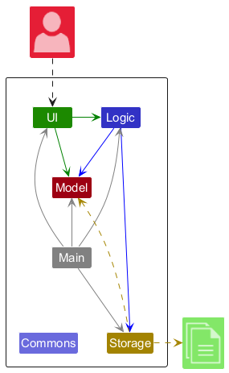

The ***Architecture Diagram*** given above explains the high-level design of the App.

Given below is a quick overview of main components and how they interact with each other.

**Main components of the architecture**

**`Main`** (consisting of classes [`Main`](https://github.com/se-edu/addressbook-level3/tree/master/src/main/java/seedu/address/Main.java) and [`MainApp`](https://github.com/se-edu/addressbook-level3/tree/master/src/main/java/seedu/address/MainApp.java)) is in charge of the app launch and shut down.
* At app launch, it initializes the other components in the correct sequence, and connects them up with each other.
* At shut down, it shuts down the other components and invokes cleanup methods where necessary.

The bulk of the app's work is done by the following four components:

* [**`UI`**](#ui-component): The UI of the App.
* [**`Logic`**](#logic-component): The command executor.
* [**`Model`**](#model-component): Holds the data of the App in memory.
* [**`Storage`**](#storage-component): Reads data from, and writes data to, the hard disk.

[**`Commons`**](#common-classes) represents a collection of classes used by multiple other components.

**How the architecture components interact with each other**

The *Sequence Diagram* below shows how the components interact with each other for the scenario where the user issues the command `delete 1`.

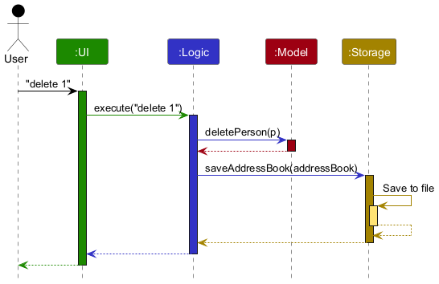

Each of the four main components (also shown in the diagram above),

* defines its *API* in an `interface` with the same name as the Component.
* implements its functionality using a concrete `{Component Name}Manager` class (which follows the corresponding API `interface` mentioned in the previous point.

For example, the `Logic` component defines its API in the `Logic.java` interface and implements its functionality using the `LogicManager.java` class which follows the `Logic` interface. Other components interact with a given component through its interface rather than the concrete class (reason: to prevent outside component's being coupled to the implementation of a component), as illustrated in the (partial) class diagram below.

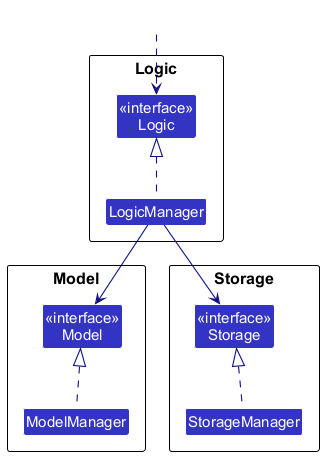

The sections below give more details of each component.

### UI component

The **API** of this component is specified in [`Ui.java`](https://github.com/se-edu/addressbook-level3/tree/master/src/main/java/seedu/address/ui/Ui.java)

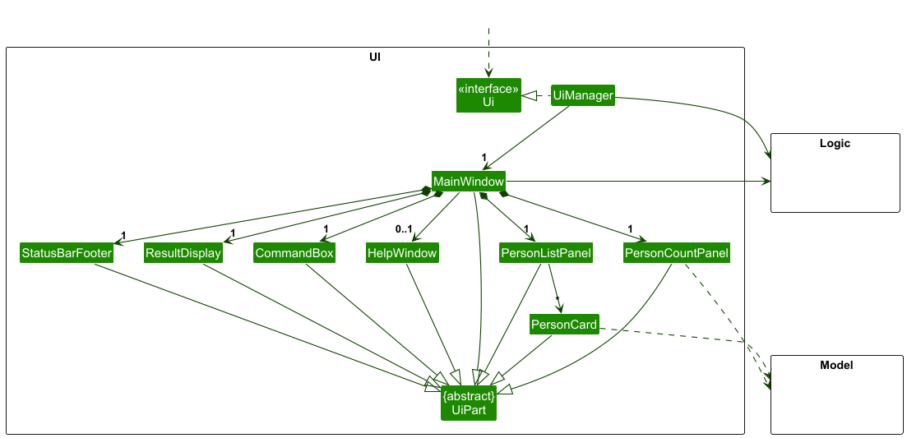

The UI consists of a `MainWindow` that is made up of parts e.g.`CommandBox`, `ResultDisplay`, `PersonListPanel`, `StatusBarFooter` etc. All these, including the `MainWindow`, inherit from the abstract `UiPart` class which captures the commonalities between classes that represent parts of the visible GUI.

The `UI` component uses the JavaFx UI framework. The layout of these UI parts are defined in matching `.fxml` files that are in the `src/main/resources/view` folder. For example, the layout of the [`MainWindow`](https://github.com/se-edu/addressbook-level3/tree/master/src/main/java/seedu/address/ui/MainWindow.java) is specified in [`MainWindow.fxml`](https://github.com/se-edu/addressbook-level3/tree/master/src/main/resources/view/MainWindow.fxml)

The `UI` component,

* executes user commands using the `Logic` component.
* listens for changes to `Model` data so that the UI can be updated with the modified data.
* keeps a reference to the `Logic` component, because the `UI` relies on the `Logic` to execute commands.
* depends on some classes in the `Model` component, as it displays `Person` object residing in the `Model`.

### Logic component

**API** : [`Logic.java`](https://github.com/se-edu/addressbook-level3/tree/master/src/main/java/seedu/address/logic/Logic.java)

Here's a (partial) class diagram of the `Logic` component:

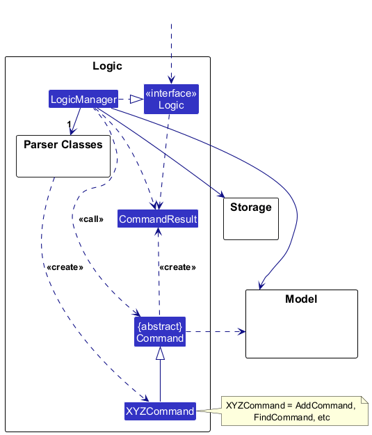

The sequence diagram below illustrates the interactions within the `Logic` component, taking `execute("delete 1")` API call as an example.

:information_source: **Note:** The lifeline for `DeleteCommandParser` should end at the destroy marker (X) but due to a limitation of PlantUML, the lifeline continues till the end of diagram.

How the `Logic` component works:

1. When `Logic` is called upon to execute a command, it is passed to an `AddressBookParser` object which in turn creates a parser that matches the command (e.g., `DeleteCommandParser`) and uses it to parse the command.
1. This results in a `Command` object (more precisely, an object of one of its subclasses e.g., `DeleteCommand`) which is executed by the `LogicManager`.
1. The command can communicate with the `Model` when it is executed (e.g. to delete a person). 
   Note that although this is shown as a single step in the diagram above (for simplicity), in the code it can take several interactions (between the command object and the `Model`) to achieve.
1. The result of the command execution is encapsulated as a `CommandResult` object which is returned back from `Logic`.

Here are the other classes in `Logic` (omitted from the class diagram above) that are used for parsing a user command:

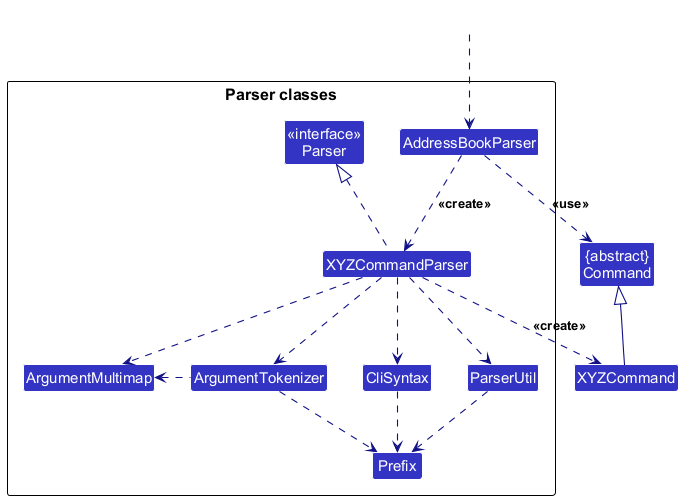

How the parsing works:
* When called upon to parse a user command, the `AddressBookParser` class creates an `XYZCommandParser` (`XYZ` is a placeholder for the specific command name e.g., `AddCommandParser`) which uses the other classes shown above to parse the user command and create a `XYZCommand` object (e.g., `AddCommand`) which the `AddressBookParser` returns back as a `Command` object.
* All `XYZCommandParser` classes (e.g., `AddCommandParser`, `DeleteCommandParser`, ...) inherit from the `Parser` interface so that they can be treated similarly where possible e.g, during testing.

### Model component
**API** : [`Model.java`](https://github.com/se-edu/addressbook-level3/tree/master/src/main/java/seedu/address/model/Model.java)

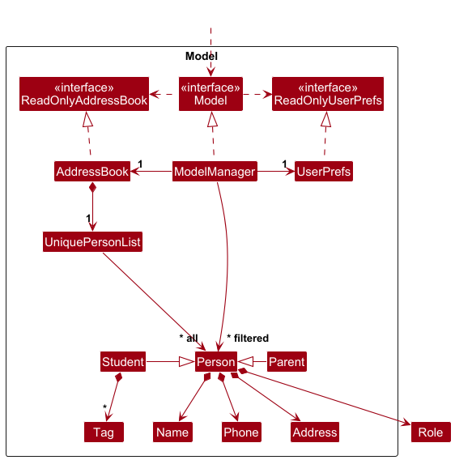

The `Model` component,

* stores the address book data i.e., all `Person` objects (which are contained in a `UniquePersonList` object).
* stores the currently 'selected' `Person` objects (e.g., results of a search query) as a separate _filtered_ list which is exposed to outsiders as an unmodifiable `ObservableList<Person>` that can be 'observed' e.g. the UI can be bound to this list so that the UI automatically updates when the data in the list change.
* stores a `UserPref` object that represents the user’s preferences. This is exposed to the outside as a `ReadOnlyUserPref` objects.
* does not depend on any of the other three components (as the `Model` represents data entities of the domain, they should make sense on their own without depending on other components)

:information_source: **Note:** An alternative (arguably, a more OOP) model is given below. It has a `Tag` list in the `AddressBook`, which `Person` references. This allows `AddressBook` to only require one `Tag` object per unique tag, instead of each `Person` needing their own `Tag` objects. 

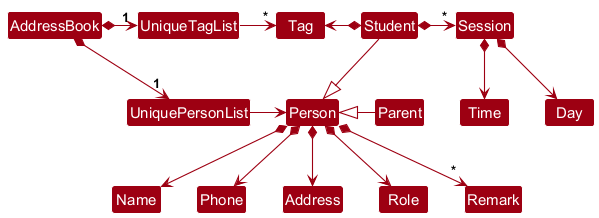

### Storage component

**API** : [`Storage.java`](https://github.com/se-edu/addressbook-level3/tree/master/src/main/java/seedu/address/storage/Storage.java)

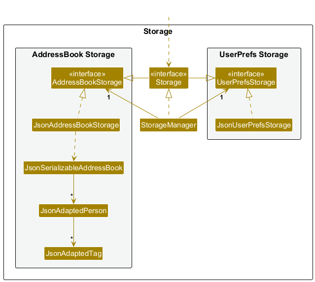

The `Storage` component,
* can save both address book data and user preference data in JSON format, and read them back into corresponding objects.
* inherits from both `AddressBookStorage` and `UserPrefStorage`, which means it can be treated as either one (if only the functionality of only one is needed).
* depends on some classes in the `Model` component (because the `Storage` component's job is to save/retrieve objects that belong to the `Model`)

### Common classes

Classes used by multiple components are in the `seedu.address.commons` package.

--------------------------------------------------------------------------------------------------------------------

## **Implementation**

This section describes some noteworthy details on how certain features are implemented.

### Remark feature

The following activity diagram summarizes what happens when a user executes a remark command:

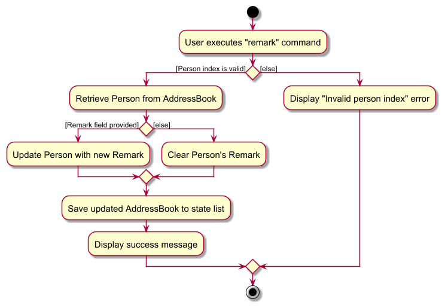

### Add Session feature

The following activity diagram summarizes what happens when a user executes an addsession command:

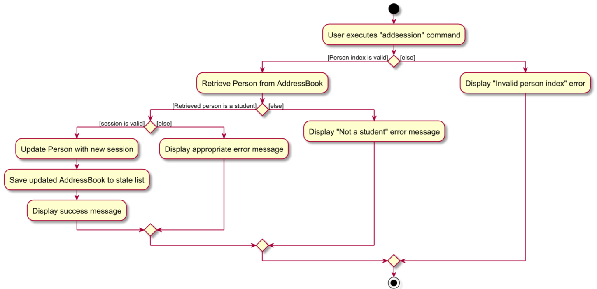

### \[Proposed\] Undo/redo feature

#### Proposed Implementation

The proposed undo/redo mechanism is facilitated by `VersionedAddressBook`. It extends `AddressBook` with an undo/redo history, stored internally as an `addressBookStateList` and `currentStatePointer`. Additionally, it implements the following operations:

* `VersionedAddressBook#commit()` — Saves the current address book state in its history.
* `VersionedAddressBook#undo()` — Restores the previous address book state from its history.
* `VersionedAddressBook#redo()` — Restores a previously undone address book state from its history.

These operations are exposed in the `Model` interface as `Model#commitAddressBook()`, `Model#undoAddressBook()` and `Model#redoAddressBook()` respectively.

Given below is an example usage scenario and how the undo/redo mechanism behaves at each step.

Step 1. The user launches the application for the first time. The `VersionedAddressBook` will be initialized with the initial address book state, and the `currentStatePointer` pointing to that single address book state.

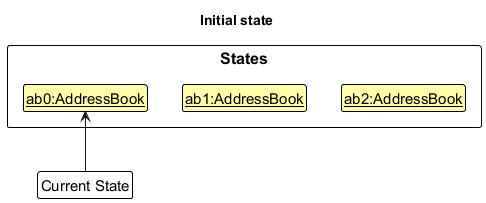

Step 2. The user executes `delete 5` command to delete the 5th person in the address book. The `delete` command calls `Model#commitAddressBook()`, causing the modified state of the address book after the `delete 5` command executes to be saved in the `addressBookStateList`, and the `currentStatePointer` is shifted to the newly inserted address book state.

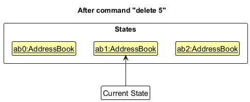

Step 3. The user executes `add n/David …​` to add a new person. The `add` command also calls `Model#commitAddressBook()`, causing another modified address book state to be saved into the `addressBookStateList`.

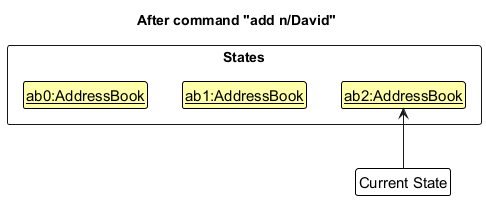

:information_source: **Note:** If a command fails its execution, it will not call `Model#commitAddressBook()`, so the address book state will not be saved into the `addressBookStateList`.

Step 4. The user now decides that adding the person was a mistake, and decides to undo that action by executing the `undo` command. The `undo` command will call `Model#undoAddressBook()`, which will shift the `currentStatePointer` once to the left, pointing it to the previous address book state, and restores the address book to that state.

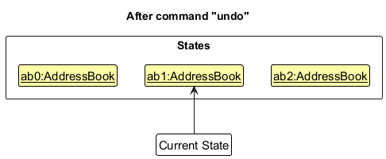

:information_source: **Note:** If the `currentStatePointer` is at index 0, pointing to the initial AddressBook state, then there are no previous AddressBook states to restore. The `undo` command uses `Model#canUndoAddressBook()` to check if this is the case. If so, it will return an error to the user rather
than attempting to perform the undo.

The following sequence diagram shows how an undo operation goes through the `Logic` component:

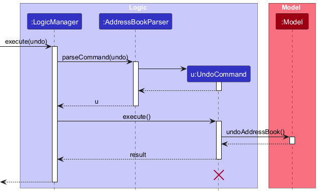

:information_source: **Note:** The lifeline for `UndoCommand` should end at the destroy marker (X) but due to a limitation of PlantUML, the lifeline reaches the end of diagram.

Similarly, how an undo operation goes through the `Model` component is shown below:

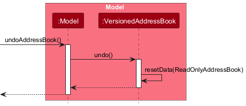

The `redo` command does the opposite — it calls `Model#redoAddressBook()`, which shifts the `currentStatePointer` once to the right, pointing to the previously undone state, and restores the address book to that state.

:information_source: **Note:** If the `currentStatePointer` is at index `addressBookStateList.size() - 1`, pointing to the latest address book state, then there are no undone AddressBook states to restore. The `redo` command uses `Model#canRedoAddressBook()` to check if this is the case. If so, it will return an error to the user rather than attempting to perform the redo.

Step 5. The user then decides to execute the command `list`. Commands that do not modify the address book, such as `list`, will usually not call `Model#commitAddressBook()`, `Model#undoAddressBook()` or `Model#redoAddressBook()`. Thus, the `addressBookStateList` remains unchanged.

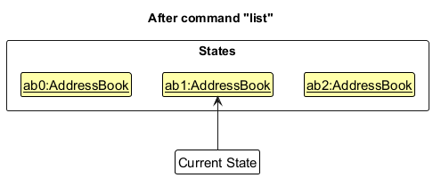

Step 6. The user executes `clear`, which calls `Model#commitAddressBook()`. Since the `currentStatePointer` is not pointing at the end of the `addressBookStateList`, all address book states after the `currentStatePointer` will be purged. Reason: It no longer makes sense to redo the `add n/David …​` command. This is the behavior that most modern desktop applications follow.

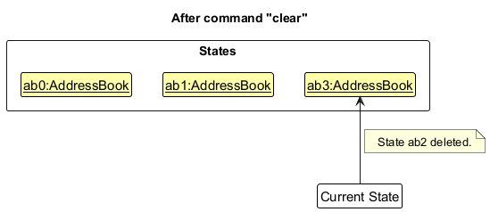

The following activity diagram summarizes what happens when a user executes a new command:

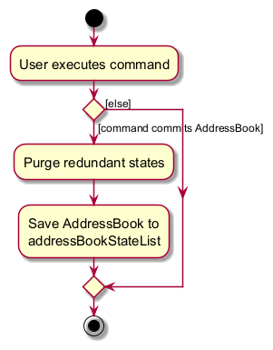

#### Design considerations:

**Aspect: How undo & redo executes:**

* **Alternative 1 (current choice):** Saves the entire address book.
    * Pros: Easy to implement.
    * Cons: May have performance issues in terms of memory usage.

* **Alternative 2:** Individual command knows how to undo/redo by
  itself.
    * Pros: Will use less memory (e.g. for `delete`, just save the person being deleted).
    * Cons: We must ensure that the implementation of each individual command are correct.

_{more aspects and alternatives to be added}_

### \[Proposed\] Data archiving

_{Explain here how the data archiving feature will be implemented}_

### Edit session

The `edit session` command modifies an existing session in the address book. The implementation involves the following steps:

1. **Parsing**: The command is parsed to extract the relevant information such as the index of the student, the day and time of the session, and the new day and time of the session if applicable.
2. **Validation**: The command is validated to ensure that the index of the student is valid and that the new day and time of the session (if applicable) are valid.
3. **Execution**: The session is modified in the address book. If the new day and time of the session are applicable, the session is updated with the new day and time. Otherwise, the session is deleted.
4. **Committing**: The address book state is committed to the `addressBookStateList`. The `currentStatePointer` is not changed as the user is not undoing or redoing any commands.
5. **Saving the state**: The `addressBookStateList` is saved to disk to persist the state of the address book.

--------------------------------------------------------------------------------------------------------------------

## **Documentation, logging, testing, configuration, dev-ops**

* [Documentation guide](Documentation.md)
* [Testing guide](Testing.md)
* [Logging guide](Logging.md)
* [Configuration guide](Configuration.md)
* [DevOps guide](DevOps.md)

--------------------------------------------------------------------------------------------------------------------

## **Appendix: Requirements**

### Product scope

**Target user profile**:

* has a need to manage a significant number of contacts
* prefer desktop apps over other types
* can type fast
* prefers typing to mouse interactions
* is reasonably comfortable using CLI apps

**Value proposition**: Helps private tutors efficiently manage student and parent contact information, ensuring quick access to details and smooth communication

### User stories

Priorities: High (must have) - `* * *`, Medium (nice to have) - `* *`, Low (unlikely to have) - `*`

| Priority | As a …​                                    | I want to …​                                                  | So that I can…​                                                                |
| -------- | ------------------------------------------ |---------------------------------------------------------------|--------------------------------------------------------------------------------|
| `* * *`  | user                                       | add student contact with name, address and phone number       | build my address book                                                          
| `* * *`  | user                                       | view all contacts                                             | see what is stored  without filtering or sorting                               |
| `* * *`  | user                                       | delete a contact by index                                     | remove entries that I no longer need                                           |
| `* * *`  | user                                       | find a person by name                                         | locate details of persons without having to go through the entire list         |
| `* *`    | tutor                                      | add a parent contact with name, address and phone number      | have another point of contact                                                  |
| `* *`    | tutor                                      | link a parent contact to the student                          | contact the parent if needed                                                   |
| `*`      | new tutor | see the system populate the address book with sample students | understand how it works                                                        |
| `*`      | tutor | filter my contacts according to roles                         | have an easier time searching for a certain individual if needed be
| `*`      | tutor | see what classes i have on a specific date                    | better prepare for class                                                       |
| `*`      | tutor | filter students according to subject                          | know which student belongs to which class                                      |
| `*`      | tutor | leave remark about each student                               | keep track of learning progress and special requests
| `*`      | tutor | display the student's timeslot in a readable format           | easily plan future timeslots for students                                      |
*{More to be added}*

## Edit Session Command

The `editsession` command allows users to modify an existing session's day and/or time for a student in the address book.

### Implementation

The edit session mechanism is facilitated by `EditSessionCommand` and `EditSessionCommandParser`. It extends `Command` and implements the following key operations:

* `EditSessionCommand#execute()` - Executes the command to edit a session
* `EditSessionCommand#toCopy()` - Creates a new `Person` with the updated session
* `EditSessionCommandParser#parse()` - Parses the user input and creates a new `EditSessionCommand`

Given below is an example usage scenario and how the edit session mechanism behaves at each step.

#### Example Usage Scenario

1. The user executes `editsession 1 d/Mon ti/12pm-1pm d/Tue ti/1pm-2pm` to change a session from Monday 12pm-1pm to Tuesday 1pm-2pm for the first student in the list.
2. The `AddressBookParser` identifies the command word `editsession` and creates a new `EditSessionCommandParser`.
3. The `EditSessionCommandParser` parses the arguments and creates a new `EditSessionCommand` with the provided index, old session details, and new session details.
4. The `EditSessionCommand` is executed, which:
   - Retrieves the target student from the filtered person list
   - Verifies the student exists and has the specified session
   - Creates a new `Student` object with the updated session
   - Replaces the original student with the updated one in the model
   - Updates the filtered person list

#### Activity Diagram

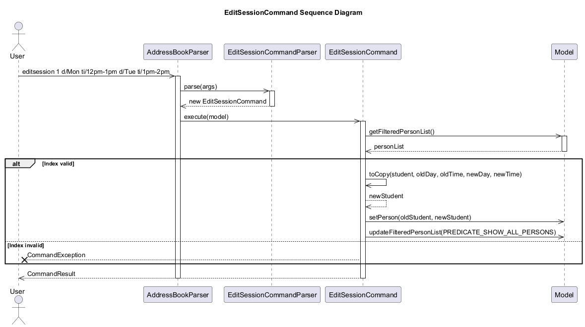

#### Design Considerations

**Aspect: How edit session executes:**

* **Alternative 1 (current choice):** Create a new Student object with updated sessions
  * Pros: Immutable objects ensure thread safety and make the code easier to reason about
  * Cons: Slight performance overhead due to object creation

* **Alternative 2:** Modify the existing Student object
  * Pros: Better performance as no new object is created
  * Cons: Mutable state can lead to bugs in a multi-threaded environment

**Aspect: Error handling:**

The command includes comprehensive error handling for cases such as:
- Invalid index
- Missing or invalid parameters
- Non-existent session
- Attempting to edit a non-student's session

## Use cases

(For all use cases below, the **System** is the `AddressBook` and the **Actor** is the `user`, unless specified otherwise.)

### UC01 — Add a student contact
**Goal**: Create a new student entry with name, address, and phone.  
**Precondition**: Application is running; storage is writable.  
**Main Success Scenario (MSS)**
1. User enters `add n/NAME a/ADDRESS p/PHONE`.
2. System validates fields and creates the contact.
3. System confirms creation and displays the new contact.  
   Use case ends.  
   **Extensions**
* 2a. Validation fails (e.g., invalid name/phone, missing field).
    * 2a1. System shows error and usage hint. Resume at step 1.
* 2b. Duplicate contact detected by exact same name and phone.
    * 2b1. System warns about duplicate and aborts creation. Use case ends.

### UC02 — List all contacts
**Goal**: Show every stored contact without filtering or sorting.  
**Precondition**: Application is running.  
**MSS**
1. User enters `list`.
2. System displays all contacts in index order.  
   Use case ends.  
   **Extensions**
* 2a. Address book is empty.
    * 2a1. System displays “no contacts” placeholder. Use case ends.

### UC03 — Find contacts by name/role
**Goal**: Locate contacts by case-insensitive name matching or role.  
**Precondition**: At least one contact exists.  
**MSS**
1. User enters `find n/NAME` or `find r/ROLE`.
2. System filters contacts whose names/role contain all provided keywords.
3. System displays the filtered list with new indices.  
   Use case ends.  
   **Extensions**
* 2a. No matches found.
    * 2a1. System shows empty result with guidance to broaden search.

### UC04 — Delete a contact by index
**Goal**: Remove one contact referenced by the current visible index.  
**Precondition**: At least one contact is visible (e.g., after `list` or `find`).  
**MSS**
1. User enters `delete I` where `I` is a 1-based index in the current list.
2. System deletes the referenced contact.
3. System confirms deletion and updates the visible list.  
   Use case ends.  
   **Extensions**
* 1a. `I` is not a valid visible index (≤0 or > list size, or non-integer).
    * 1a1. System shows error and keeps list unchanged. Use case ends.
* 2a. Underlying data changed between list and delete (rare race).
    * 2a1. System rejects operation and asks user to refresh (`list`). Use case ends.

### UC05 — [Proposed] Delete multiple contacts by indices
**Goal**: Remove several contacts in a single command.  
**Precondition**: Multiple contacts are visible.  
**MSS**
1. User enters `delete I1, I2, …, Ik` with distinct, valid visible indices.
2. System validates all indices against the current list snapshot.
3. System deletes all referenced contacts atomically.
4. System confirms deletion and updates the visible list.  
   Use case ends.  
   **Extensions**
* 2a. Any index is invalid or duplicated.
    * 2a1. System aborts the entire operation, reporting the offending indices. Use case ends.
* 3a. Partial failure due to I/O error.
    * 3a1. System rolls back and reports failure. Use case ends.

### UC06 — View help
**Goal**: Display command summary and usage.  
**Precondition**: Application is running.  
**MSS**
1. User enters `help`.
2. System opens help window/panel with command formats and examples.  
   Use case ends.

### UC07 — Exit the application
**Goal**: Close the application gracefully.  
**Precondition**: Application is running.  
**MSS**
1. User enters `exit` (or clicks the window close button).
2. System persists preferences, releases resources, and terminates.  
   Use case ends.

### UC08 — Add remarks to contact
**Goal**: Add remarks for each contact to keep track of their learning progress and special requests.  
**Precondition**: At least one contact exists.  
**MSS**
1. User enters `remark I rm/REMARK` where `I` is a 1-based index in the current list.
2. System adds remark to referenced contact.
3. System confirms addition of remark and updates the list.
Use case ends.

    **Extensions**
* 1a. `I` is not a valid visible index (≤0 or > list size, or non-integer).
    * 1a1. System shows error and keeps list unchanged. Use case ends.

### UC09 — Delete remarks for contact
**Goal**: Delete remarks for each contact to remove clutter.  
**Precondition**: At least one contact exists. 
**MSS**
1. User enters `remark I` where `I` is a 1-based index in the current list.
2. System deletes remark (if any) to referenced contact.
3. System confirms deletion of remark and updates the list.
   Use case ends.

    **Extensions**
* 1a. `I` is not a valid visible index (≤0 or > list size, or non-integer).
    * 1a1. System shows error and keeps list unchanged. Use case ends.

### UC10 — Add session to student
**Goal**: Add session to update the classes the student is in.  
**Precondition**: The student exist.
**MSS**
1. User enters `find I d/DAY ti/TIME` where `I` is a 1-based index in the current list.
2. System adds session to referenced student.
3. System confirms addition of session to student and updates the list.
   Use case ends.

**Extensions**
* 1a. `I` is not a valid visible index (≤0 or > list size, or non-integer).
    * 1a1. System shows error and keeps list unchanged. Use case ends.
* 1b. Validation fails (e.g., invalid day/time)
  * 1b1. System shows error and usage hint. Resume at step 1.
* 1c. Adding to a parent contact
  * 1c1. System shows error and keeps list unchanged.
* 1d. Duplicate session detected by exact same day and time
  * 1b1. System warns about duplicate and aborts creation. Use case ends.

### UC11 - Edit a student's session
**Goal**: Edit a student's session to update the classes the student is in.  
**Precondition**: The student exist.
**MSS**
1. Tutor requests to edit a session for a specific student by providing the student's index, old session details (day and time), and new session details (new day and time).
2. System updates the student's session with the new details.
3. System displays a success message confirming the session was edited
   Use case ends.

**Extensions**
* 1a. The given index is invalid.
    * 1a1. System shows error and keeps list unchanged. Use case ends.
* 1b. Validation fails (e.g., invalid day/time)
  * 1b1. System shows error and usage hint. Resume at step 1.
* 1c. Editing to a parent contact
  * 1c1. System shows error and keeps list unchanged.

### Non-Functional Requirements
#### Portability
1. Should work on any _mainstream OS_ as long as it has Java `17` or above installed.
#### Performance & Efficiency
2. Should be able to hold up to 1000 persons without a noticeable sluggishness in performance for typical usage.
3. A user with above average typing speed for regular English text (i.e. not code, not system admin commands) should be able to accomplish most of the tasks faster using commands than using the mouse.
#### Reliability & Availability
4. The application should not crash or lose data under normal usage conditions (adding, viewing, deleting contacts).
5. The application should be able to recover gracefully from invalid inputs without terminating unexpectedly.
#### Usability
6. Error messages should be clear, concise, and actionable, enabling the user to correct mistakes quickly.
7. Command feedback (success/error outputs) must be displayed in under 0.5 seconds to maintain responsiveness.
8. The system should preserve the user’s original casing (e.g., “Alice Tan” not “alice tan”) to avoid frustration.
#### Maintainability & Extensibility
9. The system should be designed so that new features (e.g., search, filter, update contact) can be integrated with minimal modification to existing code.
10. All source code should be documented with clear method/class descriptions to support future maintenance.

*{More to be added}*

### Glossary

* **Mainstream OS**: Windows, Linux, Unix, MacOS
* **Private contact detail**: A contact detail that is not meant to be shared with others
* **Tutor**: A user of EduConnect who manages and tracks their students' and parents' contact information
* **Student**: An individual who is taught by a tutor. Their contact information is stored in EduConnect
* **Parent**: The guardian or person linked to a student. Their contact information may be stored in EduConnect
* **Role**: A label assigned to each contact, indicating whether they are a `Student` or a `Parent`
* **Session**: A timeslot which a Student attends a lesson with the tutor. This only applies to `Student`
* **Tag**: A label indicating the subject a Student is taking under the tutor. This only applies to `Student`  

--------------------------------------------------------------------------------------------------------------------

## **Appendix: Instructions for manual testing**

Given below are instructions to test the app manually.

:information_source: **Note:** These instructions only provide a starting point for testers to work on;
testers are expected to do more *exploratory* testing.

### Launch and shutdown

1. Initial launch

    1. Download the jar file and copy into an empty folder

    1. Double-click the jar file Expected: Shows the GUI with a set of sample contacts. The window size may not be optimum.

1. Saving window preferences

    1. Resize the window to an optimum size. Move the window to a different location. Close the window.

    1. Re-launch the app by double-clicking the jar file. 
       Expected: The most recent window size and location is retained.

1. _{ more test cases …​ }_

### Adding Person

1. **Adding a Parent**
   - **Prerequisites**: 
     1. Another Person with these names in the test cases do not already exist inside the address book.
   1. Test Case - Adding a Parent (Success)
       `add n/Klaus Tay p/99837264 a/Cruise Centre 1 Maritime Square #02-127, 099253 r/parent`
       Expected: 
      - Success Message: "New person added: Klaus Tay; Phone: 99837264; Address: Cruise Centre 1 Maritime Square #02-127, 099253; Role: parent; Remark: ; Children: []"
      - New person named Klaus Tay added to the contact list, the person should be tagged as a Parent.
      - New person should appear at the bottom of the contacts list. If person does not appear, run the `list` command to verify the full list of contacts.
   2. Test Case - Adding a Parent with Tags (Failure)
       `add n/Bob Lee p/89658345 a/150 SOUTH BRIDGE ROAD 11-04 FOOK HAI BUILDING r/parent t/math`
       Expected:
      - Error Message: "Parents are NOT allowed to have tags! 
        add: Adds a person to the address book. Parameters: n/NAME p/PHONE a/ADDRESS r/ROLE [t/TAG]... 
        Example: add n/John Doe p/98765432 a/311, Clementi Ave 2, #02-25 r/student t/math"
      - Invalid person is **not added** to the address book
   3. Test Case - Adding a Parent with a Parent (Failure)
       `add n/Peter Peterson p/92272634 a/123 Lorong 1 Toa Payoh #02-515, 310986 r/parent par/Bob Lee`
       Expected:
      - Error Message: "Parents are NOT allowed to have parents! 
        add: Adds a person to the address book. Parameters: n/NAME p/PHONE a/ADDRESS r/ROLE [t/TAG]... 
        Example: add n/John Doe p/98765432 a/311, Clementi Ave 2, #02-25 r/student t/math"
      - Invalid person is **not added** to the address book

2. **Adding a Student** 
   - **Prerequisites**: 
     1. Another Person with these names in the test cases do not already exist inside the address book.
     2. Already completed the previous section on Adding a Parent.
   1. Test Case - Adding a Student without Tags (Success)
       `add n/Orion Lee p/98273648 a/1 HarbourFront Walk, Singapore 098585 r/student`
       Expected:
      - Success Message: "New person added: Onion Lee; Phone: 98273648; Address: 1 HarbourFront Walk, Singapore 098585; Role: student; Remark: ; Tags: ; Parent: null"
      - New person named Orion Lee added to the contact list, the person should be tagged as a Student.
      - New person should appear at the bottom of the contacts list. If person does not appear, run the `list` command to verify the full list of contacts.
   2. Test Case - Adding a Student with Tags (Success)
       `add n/Akira Lee p/98278876 a/67 Millenia Walk, Singapore 194585 r/student t/english`
       Expected:
      - Success Message: "New person added: Akira Lee; Phone: 98278876; Address: 67 Millenia Walk, Singapore 194585; Role: student; Remark: ; Tags: [english]; Parent: null"
      - New person named Akira Lee added to the contact list, the person should be tagged as a Student.
      - New person should appear at the bottom of the contacts list. If person does not appear, run the `list` command to verify the full list of contacts.
   3. Test Case - Adding a Student with Parent's name (Success)
       `add n/Ray Lee p/98927376 a/123 Lorong 1 Toa Payoh 02-515 224585 r/student par/Klaus Tay`
       Expected:
       - Success Message: "New person added: Ray Lee; Phone: 98927376; Address: 123 Lorong 1 Toa Payoh 02-515 224585; Role: student; Remark: ; Tags: ; Parent: Klaus Tay"
       - New person named Ray Lee added to the contact list, the person should be tagged as a Student.
       - New person should appear at the bottom of the contacts list. If person does not appear, run the `list` command to verify the full list of contacts.
   4. Test Case - Adding a Student with Tags and Parent's name (Success)
       `add n/Shermaine Lee p/98927376 a/Aljunied Industrial Complex 623 Aljunied Road #02-01 r/student t/science par/Klaus Tay`
       Expected:
       - Success Message: "New person added: Shermaine Lee; Phone: 98927376; Address: Aljunied Industrial Complex 623 Aljunied Road #02-01; Role: student; Remark: ; Tags: [science]; Parent: Klaus Tay"
       - New person named Shermaine Lee added to the contact list, the person should be tagged as a Student.
       - New person should appear at the bottom of the contacts list. If person does not appear, run the `list` command to verify the full list of contacts.

3. **Adding a Person**
   - **Prerequisites**: 
     1. Another Person with these names in the test cases do not already exist inside the address book.
     2. Please complete the previous 2 sections on Adding a Student and Adding a Parent.
   1. Test Case - Adding a Person with an Invalid Role (Failure)
       `add n/Jane Tan p/91234567 a/21 Choa Chu Kang Ave 4, #05-01 r/teacher`
       Expected:
      - Error Message: "Role should only be student or parent"
      - Invalid person is **not added** to the address book.
   2. Test Case - Adding a Person with an Invalid Phone Number (Failure)
       `add n/Lim Boon Kee p/12345 a/19 Orchard Road, #03-04 r/student`
       Expected:
       - Error Message: "Phone numbers should only contain numbers, start with 8 or 9 and it should be 8 digits long"
       - Invalid person is **not added** to the address book.
   3. Test Case - Adding a Person with an Invalid Name (Failure)
       `add n/@@@### p/98761234 a/21 Serangoon Avenue 1, #02-17 r/parent`
       Expected:
       - Error Message: "Names should only contain alphabetic characters, spaces, hyphens, apostrophes, and it should not be blank"
       - Invalid person is **not added** to the address book.
   4. Test Case - Adding a Person with an Invalid Address (Failure)
       `add n/Amelia Tan p/98127634 a/ r/student`
       Expected:
       - Error Message: "Addresses should be between 20 - 100 characters long and cantake any values except for special characters, and it should not be blank"
       - Invalid person is **not added** to the address book.
   5. Test Case - Adding a Duplicate Person (Failure)
       `add n/Klaus Tay p/99837264 a/Cruise Centre 1 Maritime Square #02-127, 099253 r/parent`
       Expected:
       - Error Message: "This person already exists in the address book"
       - Invalid person is **not added** to the address book.

### Editing a Person
 **Prerequisites**:
- The address book already contains several persons from the “Adding a Person” test cases, including at least one Parent (e.g. Klaus Tay) and one Student (e.g. Akira Lee).
- Ensure that the person to be edited exists in the displayed list before performing each test case.

### Leaving a remark

1. Leaving a remark on a student/parent in the list
   1. Prerequisites: List all persons using the `list` command. Ensure at least one person is displayed in the list.
   
   1. Test case: `remark 1 rm/weak at math` 
      Expected: First contact remark is updated to "weak at math". 
      The details of the remark is shown in the status message.
   
   1. Test case: `remark 1` 
      Expected: First contact remark is removed (if any) and is updated to "". 
      The details of the remark is shown in the status message.
   
   1. Test case: `remark 0 rm/weak at english` 
      Expected: No remark is added. Error details are shown in the status message. Status bar remains the same.
   
   1. Other incorrect remark commands to try: `remark`, `remark abc`, `remark 0`, `remark -1`  
      Expected: Similar to previous
   
   1. To view remarks on a person, use the `view` command. Refer to the [User Guide](UserGuide.md) for more details.

### Deleting a person

1. Deleting a person while all persons are being shown

    1. Prerequisites: List all persons using the `list` command. Multiple persons in the list.

    1. Test case: `delete 1` 
       Expected: First contact is deleted from the list. Details of the deleted contact shown in the status message. Timestamp in the status bar is updated.

    1. Test case: `delete 0` 
       Expected: No person is deleted. Error details shown in the status message. Status bar remains the same.

    1. Other incorrect delete commands to try: `delete`, `delete x`, `...` (where x is larger than the list size) 
       Expected: Similar to previous.

1. _{ more test cases …​ }_

### Saving data

1. Dealing with missing/corrupted data files

    1. _{explain how to simulate a missing/corrupted file, and the expected behavior}_

1. _{ more test cases …​ }_

### Add session to a student

1. Adding a session to a student while the contacts are being shown

    1. Prerequisites: The list is not empty and contains at least 1 student contact

    1. Test case: `addsession 1 d/Mon ti/1pm-3pm` 
       Expected: The status message informing the user that the selected student is updated. The UI shows the newly added session in the student contact

    1. Test case: `addsession 1 d/Mons ti/1pm-3pm` 
       Expected: No seession is added. Error details shown in the status message.

    1. Other incorrect delete commands to try: `addsession`, `addsession x d/Mons ti/1pm-3pm`, `...` (where x is larger than the list size) 
       Expected: Similar to previous.

1. _{ more test cases …​ }_

