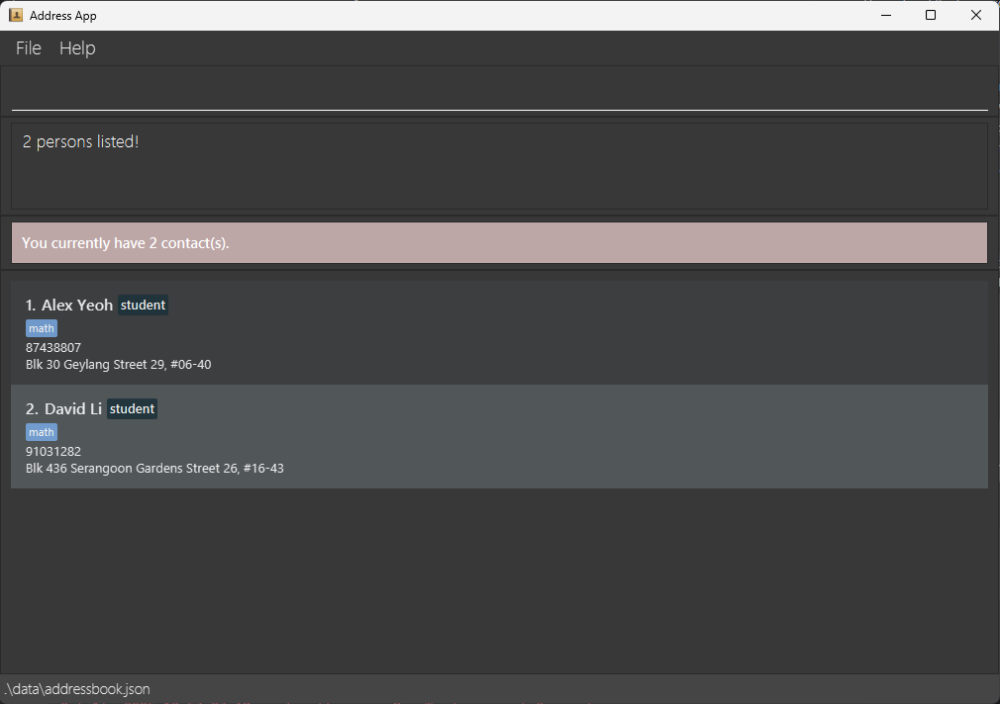
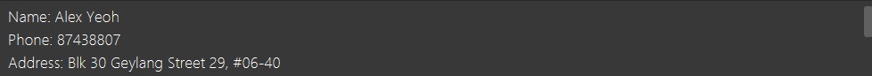
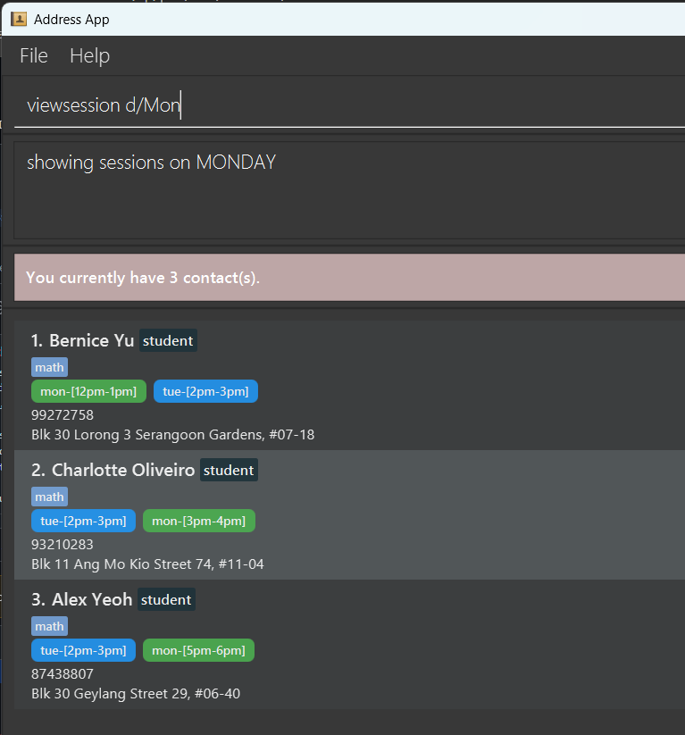

EduConnect is a desktop application that **helps tutors manage contact information for students and parents, optimized for use via a Command Line Interface** (CLI) while still having the benefits of a Graphical User Interface (GUI). If you can type fast, EduConnect can get your contact management tasks done faster than traditional GUI apps.

* Table of Contents
{:toc}

--------------------------------------------------------------------------------------------------------------------

## Quick start

1. Ensure you have Java `17` or above installed in your Computer. 
   **Mac users:** Ensure you have the precise JDK version prescribed [here](https://se-education.org/guides/tutorials/javaInstallationMac.html).

1. Download the latest `.jar` file from [here](https://github.com/AY2526S1-CS2103-F11-1/tp/releases).

1. Copy the file to the folder you want to use as the _home folder_ for your EduConnect.

1. Open a command terminal, `cd` into the folder you put the jar file in, and use the `java -jar educonnect.jar` command to run the application. 
   A GUI similar to the below should appear in a few seconds. Note how the app contains some sample data. 
   

1. Type the command in the command box and press Enter to execute it. e.g. typing **`help`** and pressing Enter will open the help window. 
   Some example commands you can try:

   * `list` : Lists all contacts.

   * `add n/John Doe p/98765432 a/John street, block 123, #01-01 r/student` : Adds a contact named `John Doe` to the Address Book.

   * `delete 3` : Deletes the 3rd contact shown in the current list.

   * `clear` : Deletes all contacts.

   * `exit` : Exits the app.

1. Refer to the [Features](#features) below for details of each command.

--------------------------------------------------------------------------------------------------------------------

## Features

**Notes about the command format:** 

* Words in `UPPER_CASE` are the parameters to be supplied by the user. 
  e.g. in `add n/NAME`, `NAME` is a parameter which can be used as `add n/John Doe`.

* Items in square brackets are optional. 
  e.g `n/NAME [t/TAG]` can be used as `n/John Doe t/friend` or as `n/John Doe`.

* Items with `…`​ after them can be used multiple times including zero times. 
  e.g. `[t/TAG]…​` can be used as ` ` (i.e. 0 times), `t/friend`, `t/friend t/family` etc.

* Parameters can be in any order. 
  e.g. if the command specifies `n/NAME p/PHONE_NUMBER`, `p/PHONE_NUMBER n/NAME` is also acceptable.

* Extraneous parameters for commands that do not take in parameters (such as `help`, `list`, `exit` and `clear`) will be ignored. 
  e.g. if the command specifies `help 123`, it will be interpreted as `help`.

* If you are using a PDF version of this document, be careful when copying and pasting commands that span multiple lines as space characters surrounding line-breaks may be omitted when copied over to the application.

### Viewing help : `help`

Shows a message explaining how to access the help page.

Format: `help`

### Adding a person: `add`

Adds a person to the address book.

Format: `add n/NAME p/PHONE_NUMBER a/ADDRESS r/ROLE [par/PARENT_NAME] [t/TAG]…`

* A person's phone number has to be a Singapore number.
* A person can have any number of tags (including 0).
* A person can have one of the two roles: `student` or `parent`, case-insensitive.
* A person that has the `student` role can have `[TAGS]`.
* A person that has the `parent` role **cannot** have `[TAGS]`.
* You may specify a parent for a student using the `par/` prefix.
  * Parents must be specified using their **full name** only.
  * The specified parent **must already exist** in the address book.
  * Only students can have a `par/` field — parents cannot have one.
  * `par/` field is not case-sensitive.
* You cannot add another person with the **same name** into the address book.

Examples:
* `add n/John Doe p/98765432 a/902 East Coast Parkway, #01-26, Singapore r/parent`
* `add n/Betsy Crowe p/87654321 a/742 Ang Mo Kio Avenue 5 12-30, Singapore  r/student t/math`
* `add n/Lorem Ipsum p/97531864 a/6001 Beach Road 02-37 Golden Mile Tower, Singapore r/student`
* `add n/Onion Lee p/99274628 a/1 HarbourFront Walk, Singapore 098585 r/student par/Keith`

### Listing all persons : `list`

Shows a list of all persons in the address book.

Format: `list`

### Editing a person : `edit`

Edits an existing person in the address book.

Format: `edit INDEX [n/NAME] [p/PHONE] [a/ADDRESS] [t/TAG]…`

* Edits the person at the specified `INDEX`. The index refers to the index number shown in the displayed person list. The index **must be a positive integer** 1, 2, 3, …​
* At least one of the optional fields must be provided.
* Role and Remark **CANNOT** be updated using this command.
* Existing values will be updated to the input values.
* When editing tags, the existing tags of the student will be removed i.e adding of tags is not cumulative.
  * You can remove all the student’s tags by typing `t/` without specifying any tags after it.
  * Only students can have tags; specifying `t/` for a parent will result in an error.
* You may specify or change a student’s parent using the `par/` prefix.
  * Parents must be specified using their **full name** only.
  * The specified parent **must already exist** in the address book.
  * Only students can have a parent; specifying `par/` for a parent will result in an error.
  * `par/` field is not case-sensitive.
* A parent’s children (Student) **cannot be edited directly**. Relationships are updated automatically when their corresponding student entries are modified.

Examples:
*  `edit 1 p/91234567` Edits the phone number of the 1st person to be `91234567`.
*  `edit 2 n/Betsy Crower t/` Edits the name of the 2nd person to be `Betsy Crower` and clears all existing tags.
*  `edit 3 n/Alex Yeo par/Keith` Edits the name and parent of the 3rd person to be `Alex Yeo` and their parent to be `Keith`. (Assuming `Keith` is a Parent that already exists in the address book)

### Locating persons by name, role or tag: `find`

Finds persons whose information matches/contains given criteria.

Format: `find [n/NAME] [r/ROLE] [t/TAG]`

* The search is case-insensitive. e.g `n/hans` will match `Hans`
* At least one of the parameters must be provided.
* The order of the keywords does not matter. e.g. `n/Hans Bo` will match `Bo Hans`
* Only the name or the role can be searched.
* Only full words will be matched e.g. `n/Han` will not match `Hans`, `r/stu` will not match `student`
* Persons matching all given parameters will be returned e.g. `find n/Alex r/student` will return all `student` named `Alex`
* For each parameter, persons matching at least one keyword will be returned (i.e. `OR` search).
    e.g. `n/Hans Bo` will return `Hans Gruber`, `Bo Yang`
* `find Alex` or `find whatever` will not work it will give the message `0 person listed`.

Examples:
* `find n/John` returns `john` and `John Doe`
* `find n/alex david` returns `Alex Yeoh`, `David Li` 

* `find r/student` returns all persons with role of `student`
* `find r/student t/math physics` returns all persons with role of `student` whose tags include either `math` or `physics`

### Deleting a person : `delete`

Deletes the specified person from the address book.

Format: `delete INDEX`

* Deletes the person at the specified `INDEX`.
* The index refers to the index number shown in the displayed person list.
* The index **must be a positive integer** 1, 2, 3, …​

Examples:
* `list` followed by `delete 2` deletes the 2nd person in the address book.
* `find n/Betsy` followed by `delete 1` deletes the 1st person in the results of the `find` command.

### Leaving a remark : `remark`

Leaves a remark about the specified person from the address book.

Format: `remark INDEX rm/REMARK`

* Leaves a remark about the person at the specified `INDEX`.
* The index refers to the index number shown in the displayer person list.
* Using `remark` again for the same person **overwrites** previous remark.

Examples:
* `remark 1 rm/Weak at math` leaves a remark on the 1st person in list.

### View detail of an entry: `view`

View the detail of the specified person from the address book.

Format: `view INDEX`

* The result is displayed in the app as a list.

* The index refers to the index number shown in the displayer person list.

### Add session: `addsession`

Adds a session of the specified person from the address book.

Format: `addsession INDEX d/DAY ti/TIME`

* Adds a session about the student at the specified `INDEX`.
* A student can have any number of sessions (including 0).
* The index refers to the index number shown in the displayed person list.
* The index **must be a positive integer** 1, 2, 3, …​
* The index referred to **must** be a `Student`.
* The start time **must not be greater than** the end time.
* The session to be added **must not overlap** another session for this particular student.
* The result is displayed in the app as a list.

Examples:
* `addsession 1 d/Mon ti/3pm-5pm`
* `addsession 1 d/Thur ti/9:30AM-11:45AM`

### Delete session: `deletesession`

Deletes a session of the specified person from the address book.

Format: `deletesession INDEX d/DAY ti/TIME`

* Deletes a session about the person at the specified `INDEX`.
* The index refers to the index number shown in the displayed person list.
* The index **must be a positive integer** 1, 2, 3, …​
* The index referred to **must** be a `Student`.
* The start time **must not be greater than** the end time.
* The session aiming to delete **must already exist** (same start time, end time, and occuring day) for the student in order for the command to succeed.

Examples:
* `deletesession 1 d/Mon ti/3pm-5pm`
* `deletesession 1 d/Thur ti/9:30AM-11:45AM`

### View session: `viewsession`

View the session(s) of the specified day from the address book. 

The sessions will be returned in order, sorted by earliest start date.

If multiple sessions have the same start time, they will be further sorted 
by lexicographic ordering of the contact name. 

Format: `viewsession d/DAY, where DAY is the day of the week`

Examples:
* `viewsession d/Mon `
* `viewsession d/Monday `
* `viewsession d/Tue `
* `viewsession d/Tues `
* `viewsession d/Tuesday `

The result is displayed in the app as a list.

  

Examples:
* `viewsession d/Mon`

### Editing a session : `editsession`

Edits an existing session of a person in the address book.

Format: `editsession INDEX d/DAY ti/TIME nd/DAY nti/TIME`

* Edits the session of the person at the specified `INDEX`. 
* The index refers to the index number shown in the displayed person list. 
* The index **must be a positive integer** 1, 2, 3, …​
* The index referred to **must** be a `Student`.
* Existing values will be updated to the input values specified by `nd/` and `nti/`.
* The start time must not be greater than the end time.

Examples:
*  `editsession 1 d/Mon ti/3pm-5pm nd/Thur nti/9:30AM-11:45AM` Edits the session's day and time of the 1st person to be `Thur` and `9:30AM-11:45AM`.
*  `editsession 2 d/Thur ti/9:30AM-11:45AM nd/Mon nti/3pm-5pm` Edits the session's day and time of the 2nd person to be `Mon` and `3pm-5pm`.

### Clearing all entries : `clear`

Clears all entries from the address book.

Format: `clear`

### Exiting the program : `exit`

Exits the program.

Format: `exit`

### Saving the data

EduConnect data are saved in the hard disk automatically after any command that changes the data. There is no need to save manually.

### Editing the data file

EduConnect data are saved automatically as a JSON file `[JAR file location]/data/addressbook.json`. Advanced users are welcome to update data directly by editing that data file.

:exclamation: **Caution:**
If your changes to the data file makes its format invalid, EduConnect will discard all data and start with an empty data file at the next run. Hence, it is recommended to take a backup of the file before editing it. 
Furthermore, certain edits can cause the EduConnect to behave in unexpected ways (e.g., if a value entered is outside of the acceptable range). Therefore, edit the data file only if you are confident that you can update it correctly.

--------------------------------------------------------------------------------------------------------------------

## FAQ

**Q**: How do I transfer my data to another Computer? 
**A**: Install the app in the other computer and overwrite the empty data file it creates with the file that contains the data of your previous EduConnect home folder.

--------------------------------------------------------------------------------------------------------------------

## Known issues

1. **When using multiple screens**, if you move the application to a secondary screen, and later switch to using only the primary screen, the GUI will open off-screen. The remedy is to delete the `preferences.json` file created by the application before running the application again.
2. **If you minimize the Help Window** and then run the `help` command (or use the `Help` menu, or the keyboard shortcut `F1`) again, the original Help Window will remain minimized, and no new Help Window will appear. The remedy is to manually restore the minimized Help Window.

--------------------------------------------------------------------------------------------------------------------

## Command summary

Action | Format, Examples
--------|------------------
**Add** | `add n/NAME p/PHONE_NUMBER a/ADDRESS r/role [t/TAG] [par/PARENT]…​`   e.g., `add n/James Ho p/98776253 a/123, Clementi Rd, 1234665 r/student t/math par/Keith Ho`
**Clear** | `clear`
**Delete** | `delete INDEX`  e.g., `delete 3`
**Edit** | `edit INDEX [n/NAME] [p/PHONE_NUMBER] [a/ADDRESS] [t/TAG] [par/PARENT]…​`  e.g.,`edit 2 n/James Lee`
**Find** | `find [n/NAME] [r/ROLE] [t/TAG]`  e.g., `find n/James Jake`
**Remark** | `remark INDEX rm/REMARK`   e.g., `remark 1 rm/hardworking`
**View** | `view INDEX`   e.g., `view 2`
**Add Session** | `addsession INDEX d/DAY ti/TIME`   e.g., `addsession 2 d/Mon ti/9am-5pm`
**Delete Session** | `deletesession INDEX d/DAY ti/TIME`   e.g., `deletesession 2 d/Mon ti/9am-5pm`
**View Session** | `viewsession d/DAY`   e.g., `viewsession d/Mon`
**Edit Session** | `editsession INDEX d/DAY ti/TIME nd/DAY nti/TIME`   e.g., `editsession 2 d/Thur ti/9:30AM-11:45AM nd/Mon nti/9.30am-11.45am`
**List** | `list`
**Help** | `help`
